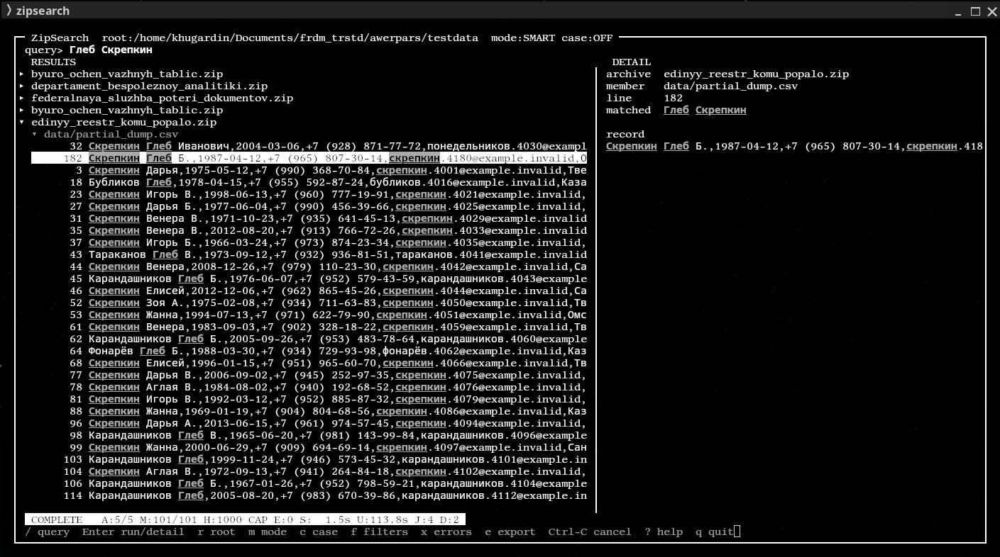

<div align="center">

[**English**](README.md) | [中文](README.zh-CN.md) | [Русский](README.ru.md)

# ZipSearch

**Search and inspect text and structured records inside ZIP archives without bulk extraction.**



</div>

ZipSearch is a local terminal tool for searching heterogeneous collections stored in ZIP files: exports, logs, spreadsheets, SQLite databases, and nested archives. It reads archive members directly, groups results for inspection, and applies bounded resource controls instead of requiring a permanently expanded working tree.

The keyboard-first TUI keeps the archive, member, result, and record detail in one view for fast inspection.

## The Four Laws

These are the core design rules of ZipSearch.

### 1. The archive is the source of truth

The original archive collection always remains authoritative. Indexes, metadata, grouping, and caches only accelerate access; they never replace or redefine the original data.

### 2. Indexing is an optimization, never admission

The index is optional acceleration. Search correctness never depends on it: if it is missing, stale, damaged, or unavailable, ZipSearch safely scans the source archives instead.

### 3. Python is enough

ZipSearch intentionally has no runtime third-party dependencies or external services. It remains portable, offline-capable, and inspectable with the Python standard library.

### 4. Search the data where it lives

ZipSearch works directly with archive members. It does not require a full corpus extraction or a persistent copied working tree.

## Why it exists

Large archive collections are awkward to inspect by hand. Expanding every archive just to locate a value duplicates storage, costs I/O, and leaves cleanup work behind. ZipSearch discovers ZIPs, reads eligible members, and exposes the resulting records through both a command-line interface and a curses TUI.

> ZipSearch does decompress data while reading it. “Without bulk extraction” means it does not expand an archive collection into a persistent directory tree. Some handlers use automatically removed temporary storage; see [Storage behavior](#storage-behavior).

## At a glance

| Area | What ZipSearch provides |
| --- | --- |
| Search | Literal, regular-expression, and normalized token-aware SMART search |
| Entities | Deterministic phones, emails/domains, URLs, IP addresses, UUIDs, and hashes; related-occurrence navigation in the TUI |
| Data | Text-like members, SQLite rows, XLSX rows, DOCX/PPTX/ODT text, nested ZIPs |
| Inspection | Archive → member → result tree; detail panel; central-directory inspection |
| Operations | Include/exclude globs, extension filters, context, root switching, export, cancellation |
| Controls | Member/count/expanded-size/compression-ratio/nesting limits; recoverable issue reporting |

## Install

Python **3.10 or newer** is required. ZipSearch has no runtime third-party dependencies.

```console
python -m pip install .
zipsearch --version
```

For a checkout used during development:

```console
python -m pip install -e . pytest ruff
```

Running `zipsearch` with no arguments opens the TUI only when both standard input and output are terminals. In scripts, use an explicit subcommand.

For an offline, single-file Python application from a source checkout:

```console
python tools/build_zipapp.py zipsearch.pyz
python zipsearch.pyz search ./archives needle
```

The zipapp bundles ZipSearch only; Python 3.10+ remains the runtime.

## Quick start

```console
# Interactive TUI, rooted at a directory or one ZIP file
zipsearch tui ./archives

# Ordinary literal search (case-insensitive by default)
zipsearch search ./archives 'customer@example.com'

# SMART: punctuation/case/word-order-aware human search
zipsearch search ./archives 'Глеб Скрепкин +79087562342' --smart

# Regex, context lines, and JSON Lines output
zipsearch search ./archives 'INV-[0-9]{8}' --regex -C 2 --jsonl > matches.jsonl

# Limit eligible member paths and extensions
zipsearch search ./archives needle --extension csv --extension json \
  --include 'exports/**' --exclude '*backup*'

# Read only an archive central directory; do not decompress members
zipsearch inspect evidence.zip --json
```

Run `zipsearch search --help` for the complete CLI reference.

## Architecture and indexing

Every result is produced from the source archive and carries its archive, member, nested path, record locator, matching evidence, structured provenance, and execution path. The planner chooses one of three transparent paths:

| Path | Operation | Correctness boundary |
| --- | --- | --- |
| **SCAN** | Stream eligible source members directly. | The baseline engine; no index is required. |
| **INDEX** | Retrieve compact candidate locators, reopen only selected source member routes, and verify matches with the shared matcher. | The index never emits a result on its own. |
| **HYBRID** | Verify fresh indexed coverage and directly scan changed, new, or otherwise uncovered archives. | Incomplete generated state cannot hide a source result. |

### Optional local index

Direct scanning is always available and remains the default on a fresh corpus. An index is a
disposable SQLite candidate map, not an import of archive contents: it stores normalized terms,
phone postings, and compact archive-local unit/line locators, but not record text. Posting segments
use a versioned delta-varint envelope with checksum validation; singleton values stay inline until
they appear in another archive. Indexed candidates are
reopened from original ZIP files and verified by the same LITERAL or SMART matcher before output.
The verifier opens only indexed archives and selected member routes; it never claims impossible
random access inside a deflated member, which still must be decompressed to recover its record.

```console
zipsearch index build ./archives
zipsearch index status ./archives
zipsearch search ./archives needle --no-index
zipsearch search ./archives 'Глеб Скрепкин +79087562342' --smart --explain
zipsearch index update ./archives
zipsearch index verify ./archives
zipsearch index clean ./archives
```

The default index is `.zipsearch.sqlite` beside a directory corpus (or beside a single archive).
Use `--index-path PATH` for another cache location, including a read-only corpus. A missing,
schema-incompatible, or corrupt index is never trusted and falls back to direct scan. For a stale or
BUILDING index, verified clean archive coverage can be used with direct scanning of changed/new
archives (`HYBRID`); incomplete generated state never hides a source result.
`index update` is resumable at archive transaction boundaries; fingerprints combine stat data with
ZIP central-directory metadata without bulk hashing archive payloads.

When an index is READY, an explainable planner still may select direct scanning. It uses candidate
archive/member coverage rather than an opaque score: selective terms and normalized phones use
`INDEX`; broad SMART candidates that would reopen nearly every member use `SCAN`; mixed freshness
uses `HYBRID`. `--explain` shows
the reason and candidate/total archive and member counts.

## Search semantics

| Mode | Selection rule | Ordering |
| --- | --- | --- |
| **LITERAL** | Each pattern is an escaped, contiguous regular-expression search. Multi-word order matters. | Archive/member/line scan order, subject to the global cap. |
| **REGEX** | Each pattern is compiled as a Python regular expression. | Archive/member/line scan order, subject to the global cap. |
| **SMART** | Normalized phrase, token, prefix, and phone evidence are considered for each query pattern. | Stronger evidence ranks first globally. |

LITERAL is the CLI default; SMART is the TUI default. `--smart` and `--regex` are mutually exclusive. Searches are case-insensitive unless `--case-sensitive` is selected; `--ignore-case` explicitly selects the default.

### SMART matching

SMART normalizes Unicode with NFKC, folds case (and Russian `ё` to `е` when case-insensitive), treats punctuation as separators, and collapses whitespace. It does not use edit distance or spelling guesses.

For a multi-token pattern, SMART ranks normalized phrase matches first, then records containing all tokens in any order, then safe token-prefix matches, then useful partial-token matches. A record may remain in the result set when only part of a multi-token query matched. For phone-shaped query components of at least seven digits, separators are ignored and Russian `8xxxxxxxxxx` is normalized to `7xxxxxxxxxx`.

For example, `Глеб Скрепкин +79087562342` can match `Игорь Скрепкин; +7 (908) 756-23-42`. The matching evidence is `Скрепкин` and the phone number; `Глеб` remains visible in the query but is not treated as evidence.

`match_type` and `score` appear in JSONL output and result-detail inspection. A score is an internal ordering signal, not a percentage or a cross-query relevance measure.

### Advanced queries and grouping

`--advanced` accepts one Boolean query with quoted phrases, implicit or explicit `AND`, `OR`, `NOT`, parentheses, token prefixes (`name*`), and deterministic selectors: `archive:`, `member:`, `format:`, `table:`, `sheet:`, `fields:`, `phone:`, and `email:`. Advanced expressions are source-verified and currently use direct scanning deliberately: complex Boolean and record-metadata semantics are not approximated by the candidate index.

Raw occurrences are the default. `--group-by exact|phone|email|entity` is an output presentation layer: human output prints each grouped occurrence, and JSONL emits a stable `group` object containing the complete raw match objects, including archive, member, locator, provenance, and execution path.

## TUI

`zipsearch tui [PATH]` opens a keyboard-first interface with an editable query line, a RESULTS pane, a DETAIL pane, and a compact status/footer area.

- **RESULTS** is a tree: archive → member → matching record. Archive and member nodes can be collapsed without changing the loaded result set, ranking, or search.
- Press **g** to cycle raw, exact, phone, email, and entity grouping. A group displays its occurrence count; Space or Enter collapses/opens its raw occurrences without discarding them.
- **DETAIL** shows the selected record, including the full original `matched` query and only the query components that contributed to that result. It also renders available archive/member metadata when a tree node is selected.
- Match evidence is underlined and may receive one restrained terminal accent color when curses color support is available. Monochrome terminals retain attribute-based highlighting. The selected row remains reverse-video.
- The status line reports archive/member counts, hits, issues, workers, nesting depth, **S** (current or last search duration), and **U** (continuously increasing TUI uptime).

### Keyboard reference

| Key | Action |
| --- | --- |
| <kbd>/</kbd> | Focus/edit the query |
| <kbd>Enter</kbd> | Run the query; when browsing, inspect the selected tree node or result |
| <kbd>↑</kbd>/<kbd>↓</kbd>, <kbd>j</kbd>/<kbd>k</kbd> | Navigate results; while editing, browse query history |
| <kbd>PgUp</kbd>/<kbd>PgDn</kbd>, <kbd>Home</kbd>/<kbd>End</kbd> | Navigate results |
| <kbd>Space</kbd> | Toggle selected archive/member node |
| <kbd>←</kbd> / <kbd>→</kbd> | Collapse / expand selected archive/member node |
| <kbd>r</kbd> | Change root (directory or `.zip`) |
| <kbd>m</kbd> | Cycle SMART → LITERAL → REGEX |
| <kbd>c</kbd> | Toggle case sensitivity |
| <kbd>f</kbd> | Open filters and limits |
| <kbd>g</kbd> | Cycle raw/exact/phone/email/entity grouping |
| <kbd>x</kbd> | Show recoverable issues |
| <kbd>e</kbd> | Export current results as JSONL, CSV, and text files |
| <kbd>Ctrl-C</kbd> | Cancel an active search |
| <kbd>?</kbd> / <kbd>q</kbd> | Help / quit |

Comma-separated TUI query components become separate patterns. Root changes preserve the query and settings but discard stale results. Query history is bounded by the entries accumulated in the session and returns to the current editable draft after the newest entry. Unless `--no-state` is supplied, TUI history and recent roots are stored as a small, capped local JSON file (`$XDG_STATE_HOME/zipsearch/state.json`, or the platform-local default). Corrupt, unavailable, read-only, or missing state is ignored; it never affects searching and contains no corpus records.

## Data and archive support

| Category | Supported input | Handling |
| --- | --- | --- |
| Container | `.zip` | Direct root archive or recursive directory discovery; nested ZIP members up to configured depth |
| Text-like members | `.txt`, `.csv`, `.tsv`, `.log`, `.json`, `.jsonl`, `.xml`, `.html`, `.htm`, `.md`, `.rst`, `.yaml`, `.yml`, `.ini`, `.cfg`, `.conf`, `.dat`, `.tad`, `.cpy` | Line-oriented decoding and search |
| SQLite | `.db`, `.sqlite`, `.sqlite3` | Read-only table rows rendered as searchable records |
| XLSX | `.xlsx` | Worksheet XML rows and shared strings rendered as searchable records |
| Office text | `.docx`, `.pptx`, `.odt` | Primary document, slide, note, header/footer, or content XML text rendered as records |

By default, members outside those extensions are skipped. `--extension EXT` selects extensions explicitly; extension, include, and exclude filters are applied to member paths. Text decoding is `auto`: UTF-8 when possible, otherwise CP1251; pass `--encoding CODEC` when the source encoding is known. A NUL byte in the initial text probe causes the member to be skipped as binary.

Nested ZIP paths are shown with `!`, for example `outer.zip:inner.zip!records.txt:42` in CLI output.

## CLI options and limits

### Common search controls

| Option | Default | Meaning |
| --- | ---: | --- |
| `--max-matches` | `1000` | Global output/result cap |
| `-C`, `--context` | `0` | Lines shown before and after a matched text record |
| `--encoding` | `auto` | `auto` or any Python codec name |
| `-j`, `--workers` | `4` | Archive worker threads |
| `--nested-depth` | `2` | Nested ZIP depth; `0` disables nested ZIP traversal |
| `--include GLOB` | — | Require a matching member path or basename; repeatable |
| `--exclude GLOB` | — | Skip matching member paths or basenames; repeatable |
| `--extension EXT` | — | Scan only selected extension(s); repeatable |
| `--no-recursive` | off | Do not descend below the input directory |
| `--no-index` | off | Force direct streaming scan even when an index is READY |
| `--index-path PATH` | — | Read a disposable index from this location |
| `--explain` | off | Report INDEX/SCAN selection and candidate planning to stderr |
| `--jsonl` | off | Write match objects and final summary as JSON Lines |
| `-q`, `--quiet` | off | Suppress human summary and warnings |

### Resource limits

| Option | Default | Checked before member decompression |
| --- | ---: | --- |
| `--max-member-mib` | `512` MiB | Declared size of one member |
| `--max-total-mib` | `2048` MiB | Declared expanded size of an archive |
| `--max-members` | `100000` | Entries in one archive |
| `--max-ratio` | `200.0` | Declared compression ratio of a member |

The TUI exposes equivalent settings: extensions, include/exclude globs, encoding, context, nesting depth, workers, cap, and the same safety limits.

## Output, export, and failure handling

Human CLI matches are written as `archive:member:line: text`; context lines use `-` and `+`. `--jsonl` emits a JSON object per match followed by one summary object. Human diagnostics and summaries are written to standard error. The TUI export command writes timestamped `.jsonl`, `.csv`, and `.txt` files in the current working directory.

Malformed archives, unreadable/unsupported members, decoding or parser failures, unsafe paths, encrypted members, and limit violations are reported as recoverable issues where possible; unrelated archives continue scanning. CLI exit status is `0` without issues, `1` when recoverable issues occurred, `2` for invalid configuration, and `130` after Ctrl-C.

## Storage behavior

ZipSearch never calls `extractall`. Ordinary text members are opened from the archive and read incrementally. SQLite requires random access, so that member alone is copied to an automatically removed temporary directory and opened read-only. XLSX, Office documents, and nested ZIP processing use spooled temporary files that remain in memory up to 8 MiB before using the system temporary area. Every such copy is bounded again by the configured member limit; embedded XLSX ZIP metadata receives independent member/count/ratio checks. Archive metadata shown by `inspect` comes from the central directory and does not decompress members.

## Direct scan path

```text
root path → deterministic ZIP discovery → bounded archive workers
         → central-directory safety checks → member decoder/parser
         → LITERAL / REGEX / SMART matching and evidence attribution
         → Match records → CLI rendering, JSONL, or TUI tree/detail/export
```

Directory discovery does not follow directory symlinks. Archive scanning uses a fixed-size thread pool and keeps at most two worker windows queued. SMART results are retained and ranked with a bounded top-N process so stronger later matches can displace weaker earlier ones.

## Benchmarks

Speed depends on archive count, compressed and expanded sizes, member formats, storage latency, query mode, filters, compression ratio, and worker count. The repository includes a small reproducible smoke benchmark; it is not a performance claim:

```console
python benchmarks/benchmark.py
```

It reports cold direct scan, initial index build, warm indexed query, index bytes, and result parity
on generated local archives. Indexed LITERAL/SMART planning uses token and normalized-phone
postings as a safe candidate superset; arbitrary regex remains direct because an inverted index
cannot generally preserve Python regex semantics.

`python benchmarks/index_benchmark.py` additionally generates rare, medium, common, phone, and
multi-component SMART workloads. It reports candidate lookup and verification separately, including
archives opened, members decompressed, declared verification bytes, index/source ratios, and parity.

`python benchmarks/index_scaling.py` measures 12-, 36-, and 72-archive deterministic corpora,
including unchanged-update cost. It intentionally reports both compressed and expanded source ratios:
SQLite metadata has substantial fixed and posting overhead on small, highly repetitive collections.

For a generated functional dataset exercised through the public CLI:

```console
python benchmarks/validate_realistic_dataset.py
```

<details>
<summary>Operational notes</summary>

Use extension/include/exclude filters to avoid decoding irrelevant members. Increasing `--workers` may help across many archives on suitable storage, but it also increases concurrent I/O and decompression. Treat raised size/ratio limits as a trust decision for the input collection.

</details>

## Safety model

Before a member is processed, ZipSearch checks entry counts, declared member and archive expansion sizes, compression ratios, unsafe paths, encryption, and nesting depth. Parser failures, malformed members, and unreadable archives become isolated issues so unrelated archives continue. Temporary random-access copies are automatically removed and are bounded independently while being read.

These controls reduce exposure to hostile input; they do not replace operating-system isolation for untrusted archives.

## Limitations

- ZIP is the only archive container supported.
- Encrypted ZIP members are skipped; password input is not implemented.
- XLSX handling reads worksheet values, not workbook formatting or formulas as a spreadsheet application would.
- SQLite and XLSX processing create temporary data as described above. The optional index is not a
  full-text copy and is removable with `zipsearch index clean`.
- Text auto-detection is intentionally limited to UTF-8 then CP1251; use `--encoding` for other known encodings.
- Safety checks reduce exposure to hostile archives but do not replace operating-system isolation for untrusted input.

## History

ZipSearch is the spiritual successor to `awerpars`, an early archive-search experiment. Its useful ideas evolved here into a more structured engineering tool with source verification, bounded processing, and a deliberately optional index.

## Development

```console
python -m pip install -e . pytest ruff build
pytest
ruff check .
python -m build
```

Run the test suite and Ruff before proposing a change. See [CONTRIBUTING.md](CONTRIBUTING.md) for contribution guidance.

## Repository layout

```text
src/zipsearch/        package: engine, search modes, CLI, renderer, TUI
tests/                engine, CLI, controller, and PTY TUI coverage
benchmarks/           reproducible smoke and generated-dataset checks
CONTRIBUTING.md       contribution guidance
LICENSE               MIT license
```

## License

Released under the [MIT License](LICENSE).
